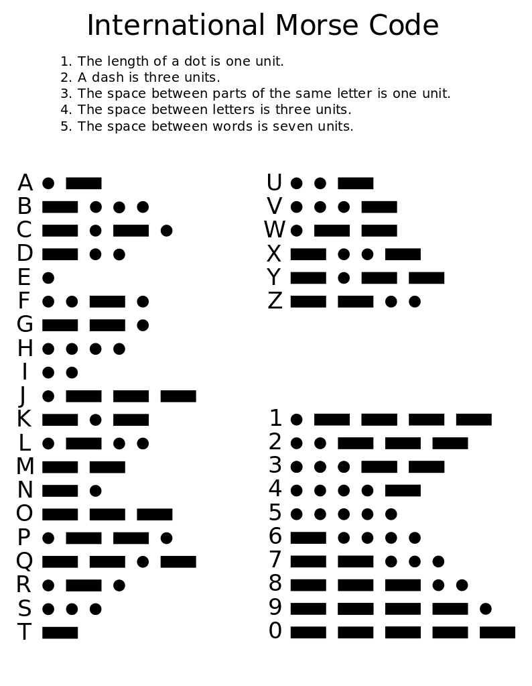

# :one: Mission 1 : Morse Code

Welcome to the missions! Time to get you trying to solve some problems...

## :dragon_face: Inspirational Quote

> If debugging is the process of removing bugs. Then programming must be the process of putting them in.

*Edsger Dijkstra*

## :ledger: Mission Brief

Output morse code!

- You need to receive a message of some kind over UART or via a Virtual COM Port hosted over USB natively on your MCU if you are feeling more adventurous!
- Using a Timer Peripheral output that message using either an LED flashing or if you want to annoy those in your vacinity, using a buzzer (or even both!)

*grabbed from here : https://text2morse.netlify.app/*

## :mag: Hints

- You will need to set up a timer to generate an interrupt, set with an appropriate time period so that you can actually observe the difference between a dot and a dash!
- There's going to need to be a buffer of incoming messages as your message input is probably going to be a faster interface than your morse output.
- We never said you could only output morse code, there might be other interfaces or IO that might be useful for keeping track of what's going on in the application!

> :shipit: Goodluck, the world is counting on you!
